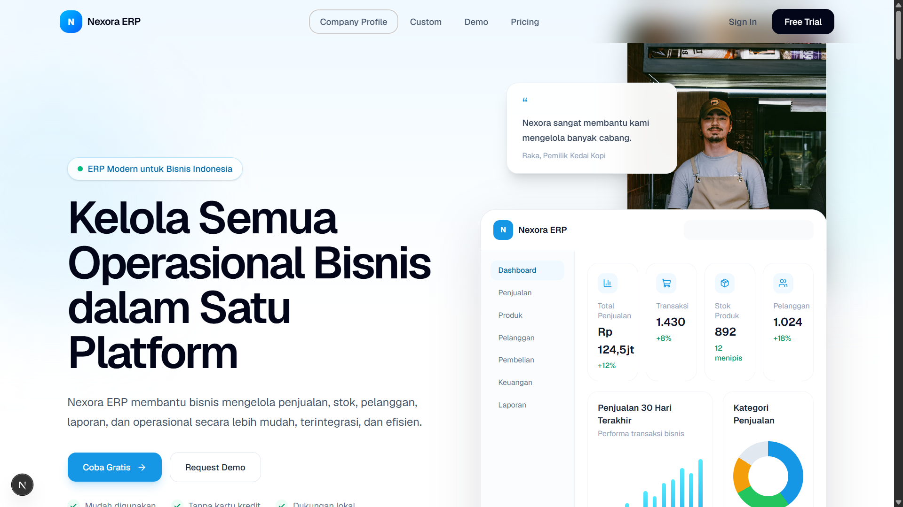
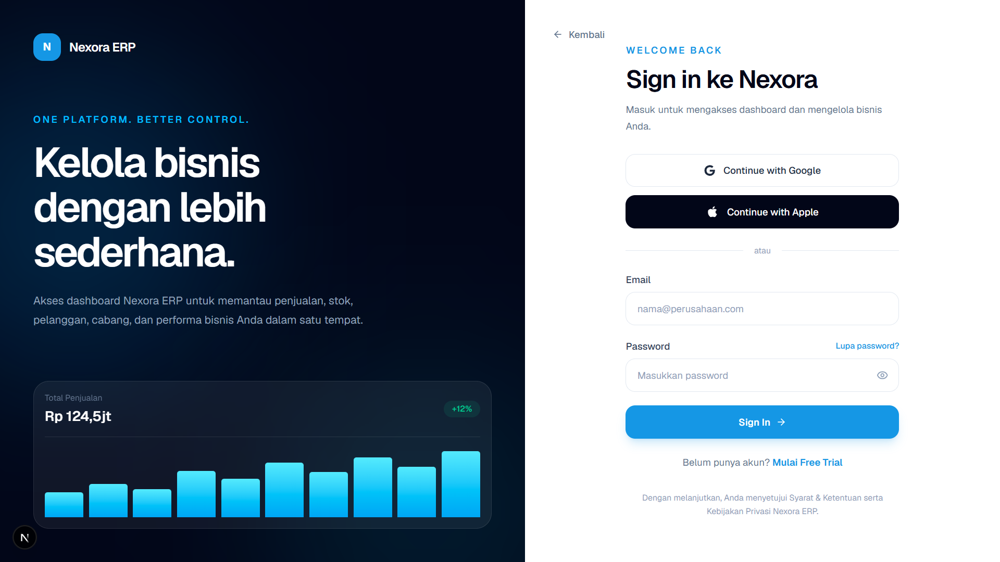
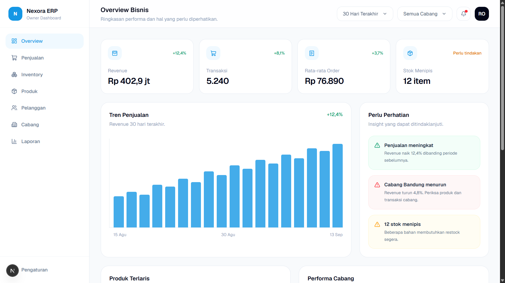
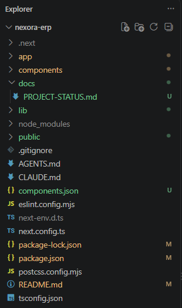

# Nexora ERP

Nexora ERP adalah prototype aplikasi SaaS/ERP berbasis web yang dirancang untuk membantu pemilik bisnis memantau dan mengelola operasional bisnis dalam satu platform.

Prototype saat ini berfokus pada pengalaman pengguna dari sisi **landing page, proses sign in, dan dashboard overview untuk owner**.

> **Status:** Frontend Prototype / Work in Progress  
> Beberapa data, aset, harga, testimonial, dan informasi bisnis yang digunakan saat ini masih bersifat dummy/placeholder dan akan diganti setelah data final tersedia.

---

## Preview Flow

```text
Landing Page
    ↓
Sign In
    ↓
Dashboard Owner
```

### Available Routes

```text
/            Landing Page
/sign-in     Sign In Page
/dashboard   Owner Dashboard Overview
```

---

## Preview

### Landing Page



### Sign In



### Dashboard Overview



### Project Structure



---

## Current Scope
    
### 1. Landing Page

Landing page digunakan untuk memperkenalkan Nexora ERP dan memberikan gambaran mengenai solusi yang ditawarkan.

Section yang sudah tersedia:

- Hero Section
- Floating / Scroll Navbar
- Trusted By / Business Features
- Industry / Jenis Usaha
- ERP Modules
- POS Product Showcase
- Multi-Branch
- Pricing
- Testimonials
- FAQ
- Final CTA
- Footer

Navbar utama saat ini menyediakan menu:

- Company Profile
- Custom
- Demo
- Pricing
- Sign In
- Free Trial

### 2. Sign In Page

Halaman Sign In sudah memiliki prototype interaksi frontend.

Fitur yang sudah tersedia:

- Email input
- Password input
- Show / Hide Password
- Email validation
- Password validation
- Loading state
- Success message
- Dummy Google Sign In
- Dummy Apple Sign In
- Dummy Forgot Password
- Dummy Free Trial interaction
- Redirect ke Dashboard setelah Sign In berhasil

Authentication yang digunakan saat ini masih berupa **dummy frontend flow** dan belum terhubung dengan backend atau database.

### 3. Owner Dashboard

Dashboard saat ini difokuskan untuk membantu owner menjawab pertanyaan:

> **"Bagaimana performa bisnis saat ini, dan apa yang perlu ditindaklanjuti?"**

Dashboard Overview saat ini menampilkan:

#### KPI

- Revenue
- Total Transaksi
- Rata-rata Nilai Order
- Stok Menipis

#### Business Overview

- Tren Penjualan
- Insight / Perlu Perhatian
- Produk Terlaris
- Performa Cabang
- Stok yang Perlu Perhatian

#### Filter

Untuk menjaga dashboard tetap sederhana dan relevan, filter saat ini hanya terdiri dari:

- Periode
- Cabang

Filter tambahan belum ditambahkan karena prototype masih berfokus pada informasi utama yang dibutuhkan owner.

---

## Dashboard Design Principles

Pengembangan dashboard mengikuti beberapa prinsip berikut:

1. Menentukan business question terlebih dahulu sebelum memilih KPI atau visualisasi.
2. Membuat struktur KPI, chart, filter, dan insight berdasarkan kebutuhan pengambilan keputusan.
3. Menjaga margin, spacing, gap, dan alignment tetap konsisten.
4. Memilih jenis visualisasi berdasarkan pertanyaan analitis.
5. Memberikan fungsi yang jelas pada setiap warna serta menjaga konsistensi unit, currency, decimal, dan percentage.
6. Menggunakan hierarchy typography yang sederhana dan konsisten.
7. Menambahkan filter hanya apabila memberikan manfaat eksplorasi data.
8. Menghapus chart, KPI, label, atau warna yang tidak membantu pengambilan keputusan.
9. Mengutamakan kualitas data karena keputusan yang baik membutuhkan data yang baik.

---

## Tech Stack

Project ini saat ini menggunakan:

- Next.js
- React
- TypeScript
- Tailwind CSS
- shadcn/ui - Base UI
- Motion
- Lucide React
- React Icons

### Framework

**Next.js App Router**

Digunakan sebagai framework utama untuk routing, component architecture, dan pengembangan frontend.

### Styling

**Tailwind CSS**

Digunakan untuk styling dan responsive layout.

### UI Components

**shadcn/ui - Base UI**

Digunakan sebagai fondasi beberapa reusable UI component seperti Accordion dan Button.

### Animation

**Motion**

Digunakan untuk animasi interface, termasuk behavior floating navbar.

### Icons

- Lucide React
- React Icons

---

## Project Structure

```text
nexora-erp/
│
├── app/
│   ├── dashboard/
│   │   ├── layout.tsx
│   │   └── page.tsx
│   │
│   ├── sign-in/
│   │   └── page.tsx
│   │
│   ├── globals.css
│   ├── layout.tsx
│   └── page.tsx
│
├── components/
│   ├── dashboard/
│   │   ├── sidebar.tsx
│   │   └── topbar.tsx
│   │
│   ├── landing/
│   │   ├── navbar.tsx
│   │   ├── hero.tsx
│   │   ├── trusted-by.tsx
│   │   ├── industries.tsx
│   │   ├── modules.tsx
│   │   ├── product-showcase.tsx
│   │   ├── multi-branch.tsx
│   │   ├── pricing.tsx
│   │   ├── testimonials.tsx
│   │   ├── faq.tsx
│   │   ├── cta.tsx
│   │   └── footer.tsx
│   │
│   └── ui/
│
├── public/
│   └── images/
│
├── package.json
├── components.json
└── README.md
```

---

## Installation

Pastikan Node.js dan npm sudah terinstall.

Clone repository atau buka project, kemudian jalankan:

```bash
npm install
```

Setelah dependency selesai di-install:

```bash
npm run dev
```

Buka browser:

```text
http://localhost:3000
```

---

## Demo Sign In

Karena authentication masih menggunakan dummy frontend flow, pengguna dapat mencoba form dengan format seperti:

```text
Email:
test@nexora.com

Password:
123456
```

Setelah validasi berhasil:

```text
Sign In
→ Loading
→ Success Message
→ Redirect /dashboard
```

Data tersebut bukan akun asli dan tidak tersimpan pada database.

---

## Dummy / Placeholder Content

Prototype saat ini masih menggunakan beberapa konten sementara, di antaranya:

- Pricing
- Customer Testimonials
- Customer Names
- Customer Roles
- Customer Photos
- Partner / Business Names
- Dashboard Metrics
- Revenue Data
- Transaction Data
- Product Data
- Branch Data
- Stock Data
- Business Insights

Konten tersebut dibuat untuk kebutuhan visualisasi prototype dan bukan merupakan data bisnis sebenarnya.

Sebelum production, seluruh data dummy harus diganti dengan aset serta data final.

---

## Current Development Status

| Feature | Status |
|---|---|
| Landing Page | ✅ Prototype selesai |
| Responsive Navbar | ✅ Selesai |
| Floating Navbar | ✅ Selesai |
| Product Showcase | ✅ Selesai |
| Multi-Branch Section | ✅ Selesai |
| Pricing UI | ✅ Selesai |
| Testimonials | ✅ Selesai |
| FAQ | ✅ Selesai |
| CTA & Footer | ✅ Selesai |
| Sign In UI | ✅ Selesai |
| Form Validation | ✅ Frontend Demo |
| Show / Hide Password | ✅ Selesai |
| Sign In Loading State | ✅ Selesai |
| Dashboard Overview | ✅ Prototype |
| Google Authentication | ⏳ Belum terhubung |
| Apple Authentication | ⏳ Belum terhubung |
| Email Authentication | ⏳ Belum terhubung |
| Database | ❌ Belum dibuat |
| Backend API | ❌ Belum dibuat |
| Real Dashboard Data | ❌ Belum terhubung |
| Role & Permission | ❌ Belum dibuat |
| Production Deployment | ❌ Belum dilakukan |

---

## Current Limitations

Prototype saat ini difokuskan pada frontend dan user experience.

Beberapa fungsi belum tersedia, seperti:

- Real authentication
- Database integration
- Backend API
- Real-time business data
- Role-based access
- CRUD operation
- Real payment / subscription
- Real Free Trial registration
- Real Google OAuth
- Real Apple Sign In
- Persistent user session

---

## Next Development Phase

Setelah prototype mendapat review dan scope final disepakati, pengembangan dapat dilanjutkan ke:

- Finalisasi UI/UX
- Finalisasi business requirement
- Authentication
- Database Design
- Backend API
- User & Role Management
- Real Business Data Integration
- Dashboard Analytics
- Deployment

Prioritas implementasi akan menyesuaikan kebutuhan bisnis dan feedback setelah prototype direview.

---

## Review Notes

Untuk tahap ini, feedback terutama dibutuhkan pada:

- Struktur dan alur Landing Page
- Informasi yang disampaikan pada Landing Page
- User flow dari Landing Page → Sign In → Dashboard
- Tampilan dan kemudahan penggunaan Sign In
- KPI yang ditampilkan pada Dashboard Owner
- Informasi / insight yang dibutuhkan owner
- Fitur yang perlu diprioritaskan
- Fitur yang tidak diperlukan
- Struktur menu Dashboard
- Kebutuhan custom ERP

---

## Development Notes

Project masih dalam tahap prototype.

Keputusan mengenai fitur final, pricing, aset visual, data bisnis, authentication, backend, serta arsitektur database belum bersifat final dan dapat berubah berdasarkan kebutuhan project.

---

## Nexora ERP

**One Platform. Better Control.**

Prototype © 2026
